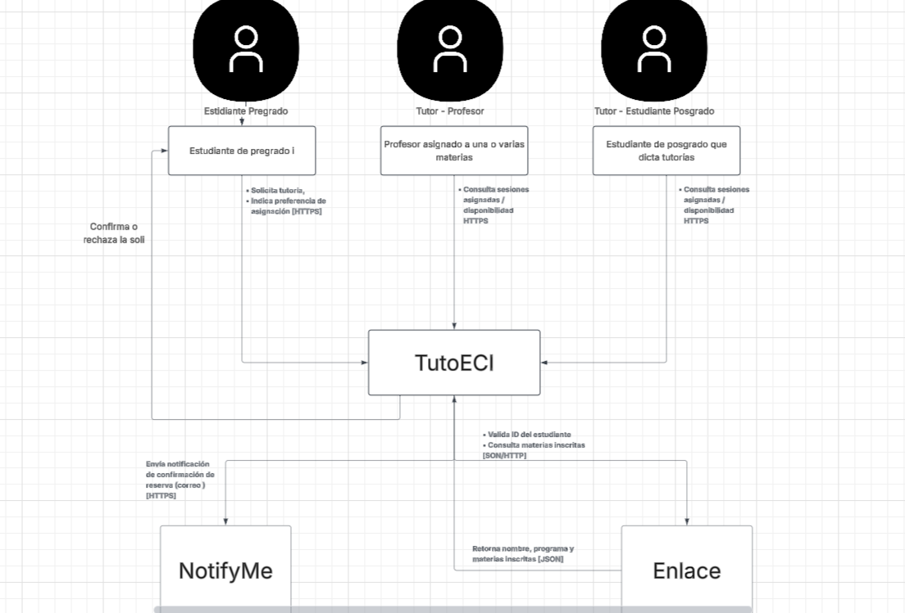

# DOSW_ParcialT1_JuanDuarte
Parcial practico tercio 1 - DOSW

## Diagrama de Contexto (C4)

## Requerimientos

| ID | Tipo | Nombre | Descripción | Prioridad |
|---|---|---|---|---|
| **RF1** | Funcional | Solicitar tutoría | El estudiante de pregrado solicita una tutoría indicando la materia y su estrategia preferida. Debe validar la inscripción contra el Enlace antes de aceptar la solicitud. | Alta |
| **RF2** | Funcional | Asignar tutor automáticamente | El sistema asigna un tutor aplicando la estrategia elegida por el estudiante. Usa el patrón Strategy ya qye cada estrategia se encapsula como una implementacon que se puede camiar de una interfaz común EstrategiaAsignacion. | Alta |
| **RF3** | Funcional | Notificar confirmación de reserva | Una vez asignada y confirmada la tutoría, el sistema envía al servicio NotifyMe correo@mail.escuelaing.edu.co\|mensaje_confirmacion | Media |
| **RNF1** | No funcional| Interfaz responsive y accesible | La UI debe adaptarse al celular y escritorio, usar la paleta institucional de Ingeniería de Sistemas y cumple con legibilidad de horarios, etc | Media |
| **RNF2** | No funcional | No se duplican datos y se consulta en tiempo real | TutoECI no debe tener localmente la información académica del estudiante; toda consulta de materias inscritas se hace enEnlac | Alta |

**Patrón de diseño:** RF2 usa Strategy porque desacopla el algoritmo de selección de tutor de la lógica de solicitud, permitiendo agregar nuevas estrategias sin modificar el flujo principal (Open/Closed).

## Historias de Usuario

### HU1 (RF1) - Solicitar tutoría
COMO estudiante de pregrado inscrito en una materia, QUIERO solicitar una tutoría indicando la materia y mi estrategia de asignación preferida, PARA recibir apoyo académico del tutor más adecuado.

**Criterios de aceptación:**
- Ya que no estoy inscrito activamente en DOSW, cuando solicito una tutoria con estrategia EXPERT_FIRST, entonces el sistema acepta la solicitud
- Ya que que no estoy inscrito en la materia solicitada, cuando la solicito el sistema la rechaza con un mensaje de error
- Ya que Enlace no responde cuandosolicito una tutoría, entonces el sistema informa que no puede validar la inscripción en este momento

### HU2 (RF2) - Asignación automática de tutor
COMO estudiante solicitante, QUIERO que el sistema me asigne automáticamente un tutor según la estrategia que elegi, PARA no buscar manualmente entre los tutores que estan

**Criterios de aceptación:**
- Ya que elijo EXPERT_FIRST y hay profesores disponibles de la materia, cuando se procesa la asignación se va asignar el profesor disponible mas cercano
- Ya que elijo EXPERT_FIRST y no hay profesores disponibles, entones el sistema busca entre estudiantes de posgrado
- Ya que elijo PEER_TUTORING, se descartan los profesores y se asigna un estudiante de posgrado del mismo programa
- ya que no hay tutores disponibles en ninguna estrategia, cuando se procesa el sistema notifica que no hay tutores disponibles.

### HU3 (RF3) - Notificación de confirmación
COMO estudiante con una tutoría confirmada, QUIERO recibir una notificación de confirmación, PARA saber que mi reserva fue exitosa

**Criterios de aceptación:**
- Yaque una tutoría fue asignada y confirmada, cuando se completa la asignación, entonces el sistema va a enviar a NotifyMe el correo|mensaje
- Ya que NotifyMe no está disponible, cuando se intenta notificar el sistema registra el error sin bloquear la confirmación de la reserva.

### HU4 (RNF1) - Interfaz responsive y accesible
COMO usuario de TutoECI en cualquier dispositivo, quiero una interfaz adaptable accesible y comoda PARA consultar horarios y perfiles de tutores sin importar el dispositivo donde este

**Criterios de aceptación:**
- Ya que accedo desde un celular cuando cargo cualquier vista, entonces el diseño se adapta bien
- Yqque se revisan los componentes visuales, cuando se mide el contraste, entonces se cumple

### HU5 (RNF2) - Consulta en tiempo real sin duplicación
COMO sistema TutoECI, QUIERO consultar la información académica en tiempo real a Enlace sin almacenar copia local ARA mantener datos actualizados y evitar redundancia.

**Criterios de aceptación:**
- yaque se solicita una tutoría, cuando el sistema consulta Enlace, entonces no esta localmente los datos del estudiante más allá de la solicitud
- Ya que Enlace responde rapido, el sistema maneja el timeout adecuadamente.

## Diseño de Software y Patrones

### patron 1: Strategy
- **Tipo:** comportamiento.
- **Justificación:** cada preferencia es distinta para elegir tutor, pero todos comparten asignarTutor(). Entonces encapsularlos como estrategiasque cambian nos deja que el gestor de asignación no conozca los detalles y que se puedan agregar nuevas preferencias sin modificar lo que ya teniasmos (osea aplocamos la O de los princips solid).

### patron 2: Adapter
- **Tipo:** Estructural.
- **Justificación:** ambos sistemas tienen sus formatos que TutoECI no controla y que podrian cambiar, entonces el adapter traduce esos formatos al modelo que TutoECI si puede "usar".

### Principios SOLID aplicados
- **S** cada estrategia solo calcula la asignación; cada adapter solo traduce un sistema externo
- **O:** nuevas estrategias o nuevos sistemas externos se agregan sin modificar el gestor de asignación.
- **L:** 
- **I:** las interfaces validan la info acadmica y para notificar son separadas y minimas
- **D:** el gestor de asignacion depende de las interfaces